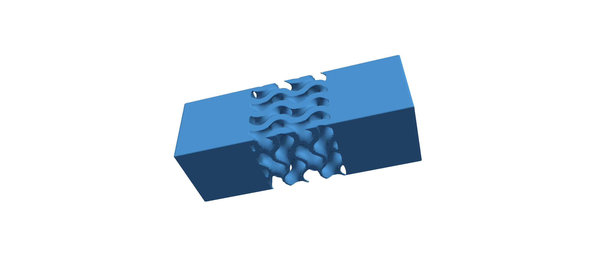
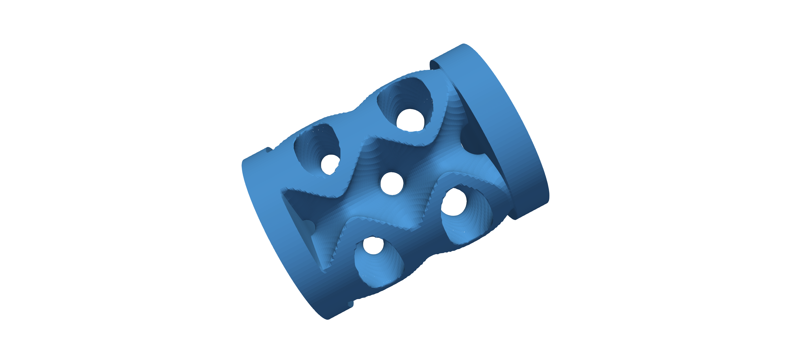
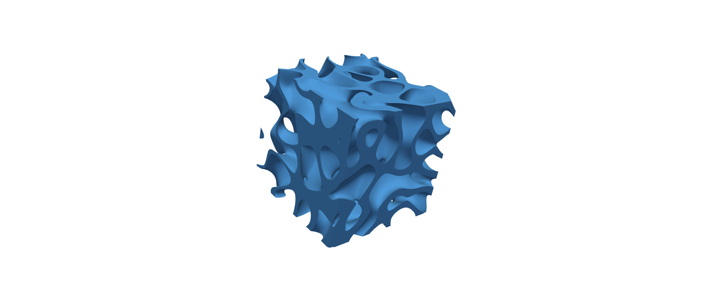
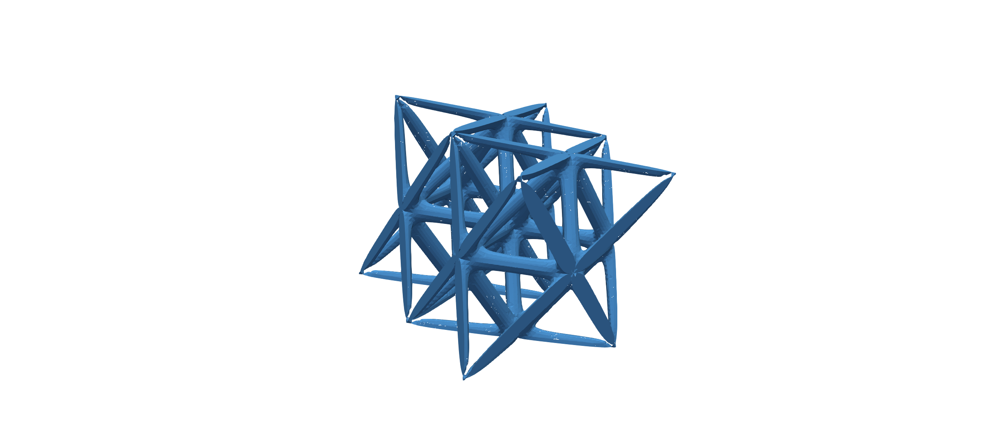
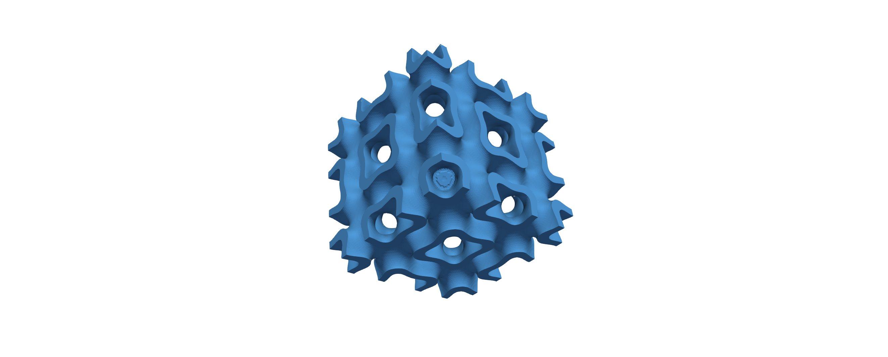
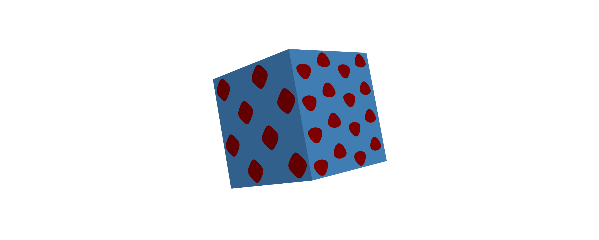

# Top-6-Class MetaStudio (Top6Meta)
<br>


**Top6Meta** is a Python-based high-performance computing software framework for the modeling and design of architected materials and metastructures. It provides unified generation of strut lattices, TPMS, and stochastic spinodal topologies, including hybrid, functionally graded, and interpenetrating phase composite designs. The software supports metamaterials as standalone architectures as well as architected beams, plates, and sandwich structures. Time-intensive geometry generation is accelerated through parallel and vectorized HPC implementations. Top6Meta is designed as a modular, extensible research tool bridging mesoscale topology generation with engineering-scale applications. 

<!-- > ☕ If Top6Meta has been useful in your research or projects, you can support its continued development here:  
> https://buymeacoffee.com/NAME -->

> **Stay updated**
>
> If you would like to receive updates about new releases, bug fixes, and major changes to Top6Meta,
> you can subscribe to the project changelog and update notifications via the form below:
>
> 👉 https://forms.gle/cArVMLCCcdhhZWzL9

## Table of Contents
* [About](#about)
  * [Software Architecture](#software-architecture)
  * [Flexibility via Command-line Execution](#flexibility-via-command-line-execution)
* [Installation](#installation)
* [API Overview](#api-overview)
  * [TPMS, SPIN Function Signature & Parameters Reference](#tpms-spin-function-signature--parameters-reference)
  * [STRUT Function Signature & Parameters Reference](#strut-function-signature--parameters-reference)
  * [HYBRID Function Signature & Parameters Reference](#hybrid-function-signature--parameters-reference)
  * [LAYERED / IPCs Function Signature & Parameters Reference](#layered--ipcs-function-signature--parameters-reference)
* [Examples](#examples)
  * [Example 1 — TPMS Gyroid Architected Beam](#example-1--tpms-gyroid-architected-beam)
  * [Example 2 — TPMS Primitive Cell Cylindrical Sandwich](#example-2--tpms-primitive-cell-cylindrical-sandwich)
  * [Example 3 — Spinodal Architecture (SPIN)](#example-3--spinodal-architecture-spin)
  * [Example 4 — Strut-Based Lattice (Strut-Diameter Design)](#example-4--strut-based-lattice-strut-diameter-design)
  * [Example 5 — Two-Layer Hybrid TPMS Architecture](#example-5--two-layer-hybrid-tpms-architecture)
  * [Example 6 — Layered TPMS Architecture (IPCs)](#example-6--layered-tpms-architecture-ipcs)

## About

### Software Architecture

Top6Meta is organized into three cooperating components designed for scalability and extensibility.
The backend contains all geometry-generation routines and supporting utilities, including implicit
field evaluation, resolution control, functional grading, hybridization, and strut-network
construction. An intermediate process-management layer coordinates task execution and optional
multiprocessing, handling data exchange and worker orchestration. The frontend provides the
graphical user interface (GUI), delegating all computational tasks to the backend, enabling both
interactive use and high-performance execution within a unified framework.

### Flexibility via Command-line Execution

In addition to the GUI, Top6Meta supports programmatic and headless execution through its backend
API, enabling automated workflows, scripting, and large-scale parametric studies. The core
generator functions can be invoked directly from Python or integrated with job schedulers.
A detailed description of the available routines and their usage is provided in the
[API Overview](#api-overview).

## Installation

1.  Clone the repository and navigate to its directory:

    ```bash
    https://github.com/ECM-LAB-NYU/Top6Meta.git
    cd Top6Meta
    ```
2.  Run the setup script (skip if already installed):

    ```bash
    # Linux AArch64/x86_64 or macOS ARM64
    chmod +x setup-unix.sh
    ./setup-unix.sh

    # Windows
    setup-windows.bat
    ```

3.  Activate the Conda environment and run the GUI:
    ```bash
    conda activate modeling_studio
    cd gui
    python top6meta.py
    ```

>[!NOTE]
> **After installing Miniconda:**
> 
> - If Conda was installed by the setup script, make it available in the current terminal with:
>   ```bash
>   source ~/miniconda3/etc/profile.d/conda.sh
>   ```
> * **Requirement:** Python $\ge 3.9$ is required.

---

### Installation Walkthrough (Optional)
If you prefer a visual walkthrough, short installation videos are available below.

<details>
<summary><strong>Windows installation (video)</strong></summary>

https://github.com/ECM-LAB-NYU/Top6Meta/blob/main/media/how_to_windows.mp4

</details>

<details>
<summary><strong>macOS / Linux installation (video)</strong></summary>

https://github.com/ECM-LAB-NYU/Top6Meta/blob/main/media/how_to_mac_linux.mp4

</details>

---

## API Overview

All generator functions in Top6Meta follow a common design philosophy centered on explicit geometric
control, resolution management, functional grading, and optional high-performance multiprocessing.
Architected materials can be generated programmatically through four main routines:

- `generate_tpms` — TPMS and Spinodal architectures  
- `generate_hybrid` — multi-morphology hybrid designs  
- `generate_strut` — strut-based lattice networks  
- `generate_layered` — layered structures and IPCs

>[!WARNING]
> Spinodal (SPIN) architectures are generated through the `generate_tpms` routine by setting
> `Archi='SPIN'`. There is no separate SPIN-specific generator function.

### TPMS, SPIN Function Signature & Parameters Reference

```python
from python import tpms_core
F, V, FinalVolumeFrac, FinalSurfaceArea = tpms_core.generate_tpms(
                Archi='GY', 
                Type='TPSF', 
                Structure='Lattice',
                Shape='Cubic', a=10.0, b=10.0, c=10.0,
                rad=10.0, heit=40.0,
                Bfcplt_tkns=4, Tfcplt_tkns=3,
                LSuprt_tkns=10, RSuprt_tkns=10,
                nx=2, ny=2, nz=2,
                Volu_Tol=0.01, Volume_Fraction=30.0,
                XD_Roll=0, YD_pitch=0, ZD_yaw=0,
                Alph_StrchX=1.0, Beta_StrchY=1.0, 
                Gamma_StrchZ=1.0,
                MDP=71, W_Tnum=1000, IPC='IPC_N',
                Gradation='Constant', 
                GradationDirection='ZGraded',
                FGType=1, Volume_Fraction1=20, 
                Volume_Fraction2=50,
                savestl=False,
                run_parallel=False)
```

| Parameter                | Meaning / Options                                                                                     | Limits / Notes                                           |
|--------------------------|--------------------------------------------------------------------------------------------------------|-----------------------------------------------------------|
| **Archi**                | TPMS topology code (`GY`, `SPC`, `FKS`, `SCD`, `NE`, `LD`, `SCH`, `SLP`, `I2Y`, `FKCS`, `FRD`); Spinodal: `'SPIN'` | Must match backend-defined identifiers                    |
| **Type**                 | Architecture mode: `TPSF` (sheet), `TPSN` (skeletal), `TPSX` (exoskeletal)                            | —                                                         |
| **Structure**            | Structural context: `Lattice`, `Sandwich`, `Beam`                                                      | Activates thickness parameters                            |
| **Thickness Parameters** | For `Sandwich`: `Bfcplt_tkns`, `Tfcplt_tkns`; For `Beam`: `LSuprt_tkns`, `RSuprt_tkns`                | Positive floats; must be compatible with domain height    |
| **Shape**                | Domain type: `Cubic` or `Cylindrical`                                                                  | —                                                         |
| **Dimensions**           | Cubic: `a`, `b`, `c`; Cylindrical: `rad`, `heit`                                                       | Positive floats (≈0.2–1000)                               |
| **Repetitions**          | `nx`, `ny`, `nz` — unit cell replication counts                                                        | Integers 2–5                                           |
| **Volume_Fraction**      | Target relative density                                                                                | Range: 10–50%                                     |
| **Rotation Angles**      | `XD_Roll`, `YD_pitch`, `ZD_yaw`                                                                        | 0–180°                                                    |
| **Stretch Factors**      | `Alph_StrchX`, `Beta_StrchY`, `Gamma_StrchZ`                                                           | Floats ≈0.5–2                                             |
| **MDP**                  | Implicit-grid resolution                                                                               | Integers; 50–1000 allowed; 50–150 recommended                       |
| **W_Tnum**               | Wave-number parameter for SPIN                                                                         | Integers ≈100–10000                                       |
| **Gradation**            | Functional grading mode: `Constant`, `Graded`                                                          | —                                                         |
| **GradationDirection**   | `XGraded`, `YGraded`, `ZGraded`                                                                        | Applies only if `Gradation='Graded'`                      |
| **FGType**               | Grading profile: `1` Linear, `2` Cosine, `3` Sinusoidal, `4` V-min, `5` V-max                          | Applies only if `Gradation='Graded'`                      |
| **Volume Fraction Range**| Lower/upper density bounds: `Volume_Fraction1`, `Volume_Fraction2`                                     | Applies only if `Gradation='Graded'`                      |
| **IPC**                  | `IPC_N` (primary phase), `IPC_Y` (primary + complementary phase)                                       | IPC_Y returns both phases                                 |
| **run_parallel**         | Enables multiprocessing                                                                                | `True`/`False`                                            |
| **savestl**              | Save generated geometry as `.stl`                                                                      | `True`/`False`                                            |

>[!WARNING]
> `Cylindrical` shape is not supported for `Beam` structures. Use `Cubic` shape instead.


#### Return Values

The output of `generate_tpms` depends on the value of the `IPC` flag.

**When `IPC='IPC_N'` (default):**
- `F` — Faces of the primary architecture mesh  
- `V` — Vertices of the primary architecture mesh  
- `FinalVolumeFrac` — Achieved relative density  
- `FinalSurfaceArea` — Surface area of the generated architecture  

**When `IPC='IPC_Y'`:**
- `F` — Faces of the primary (reinforcement) phase  
- `V` — Vertices of the primary (reinforcement) phase  
- `F_matrix` — Faces of the complementary (matrix) phase  
- `V_matrix` — Vertices of the complementary (matrix) phase  
- `FinalVolumeFrac` — Achieved relative density of the primary phase  
- `FinalSurfaceArea` — Surface area of the primary architecture  

All returned meshes follow a face–vertex representation suitable for downstream meshing, visualization, or export.

### STRUT Function Signature & Parameters Reference

```python
from python import tpms_core
F, V, Vol_frac, FSurf = tpms_core.generate_strut(
                DesignType='StrutD',
                latticeFamily=5,
                xRep=2, yRep=2, zRep=2, 
                sx=10, sy=10, sz=10,    
                MDP=101, finalLatticeRes=51,
                bendingStrutRadius=0.04, stretchingStrutRadius=0.04,
                verticalStrutRadius=0.04, jointRadius=0.09,
                bendingStrutRadius_min=0.09, stretchingStrutRadius_min=0.09,
                verticalStrutRadius_min=0.04, jointRadius_min=0.09,
                bendingStrutRadius_max=0.09, stretchingStrutRadius_max=0.09,
                verticalStrutRadius_max=0.09, jointRadius_max=0.19,
                volumeFraction=20,                
                volumeFraction_min=20, volumeFraction_max=40,                   
                GradationDirection='Constant',        
                FGType=0,                             
                savestl=False,
                run_parallel=False,
                IPC='IPC_N')
```

| Parameter                        | Meaning / Options                                                                                                                           | Limits / Notes                                                                |
| -------------------------------- | ------------------------------------------------------------------------------------------------------------------------------------------- | ----------------------------------------------------------------------------- |
| **DesignType**                   | Strut design mode: `StrutD` (radius-controlled) or `VolFracBased` (density-controlled)                                                      | Determines whether radii or volume fraction define geometry                   |
| **latticeFamily**                | 5: Standard Octet, 6: Reinforced Octet, 7: Octahedral, 8: Reinforced Octahedral, 9: Circular Octahedral, 10: BCC, 11: FCC, 12: Dodecahedral | Allowed range: 5–12                                                           |
| **Repetitions**                  | `xRep`, `yRep`, `zRep` — unit-cell replication counts                                                                                       | Integers 2–5                                                               |
| **Dimensions**                   | `sx`, `sy`, `sz` — unit-cell dimensions                                                                                                     | Positive floats (~0.2–1000)                                                   |
| **MDP**                  | Resolution of the single-cell discretization                                                                                                | Integers; 50–1000 allowed; 50–150 recommended                                 |
| **finalLatticeRes**              | Resolution of the assembled full lattice                                                                                                    | Integers; 50–1000 allowed; 50–150 recommended                                 |
| **Base Radii**                   | `bendingStrutRadius`, `stretchingStrutRadius`, `verticalStrutRadius`, `jointRadius`                                                         | Used when `DesignType='StrutD'`                                               |
| **Radius_min / Radius_max sets** | Lower/upper bounds for each radius type for graded struts                                                                                   | Used when `DesignType='StrutD'` **and** `GradationDirection ≠ Constant`       |
| **volumeFraction**               | Global density target for `VolFracBased` mode                                                                                               | Typical 10–50%                                                                |
| **volumeFraction_min / max**     | Density bounds for graded density-based struts                                                                                              | Used when `DesignType='VolFracBased'` **and** `GradationDirection ≠ Constant` |
| **GradationDirection**           | `Constant`, `XGraded`, `YGraded`, `ZGraded`                                                                                                 | Only used if grading is active                                                |
| **FGType**                       | 0 = Constant, 1 = Linear, 2 = Cosine, 3 = Sinusoidal, 4 = V-min, 5 = V-max                                                                  | Applies only when grading enabled                                             |
| **savestl**                      | Export the strut lattice as `.stl`                                                                                                          | `True` / `False`                                                              |
| **run_parallel**                 | Enables multiprocessing (DimLoop acceleration)                                                                                              | `True` / `False`                                                              |
| **IPC**                          | `IPC_N` (primary phase only), `IPC_Y` (primary + complementary phase)                                                                       | Enables interpenetrating-phase output                                         |

#### Return Values

The output of `generate_strut` depends on the value of the `IPC` flag.

**When `IPC='IPC_N'` (default):**
- `F` — Faces of the primary strut-lattice mesh  
- `V` — Vertices of the primary strut-lattice mesh  
- `Vol_frac` — Achieved relative density of the generated lattice  
- `FSurf` — Surface area of the strut lattice  

**When `IPC='IPC_Y'`:**
- `F` — Faces of the primary (reinforcement) strut lattice  
- `V` — Vertices of the primary (reinforcement) strut lattice  
- `F_matrix` — Faces of the complementary (matrix) phase  
- `V_matrix` — Vertices of the complementary (matrix) phase  
- `Vol_frac` — Achieved relative density of the primary phase  
- `FSurf` — Surface area of the primary strut lattice  

The returned meshes follow a face–vertex representation suitable for visualization, meshing, export to STL, or downstream numerical analysis.


### HYBRID Function Signature & Parameters Reference

```python
from python import tpms_core
F, V, FinalVolumeFrac, FinalSurfaceArea = tpms_core.generate_hybrid(
                Base_class=['TPMS', 'TPMS'],
                Archi=['GY', 'IWP'],
                Type=['TPSF', 'TPSF'],
                HybridType=2,
                CylHyType=3,
                a=20.0, b=20.0, c=20.0,
                nx=[3, 3],
                ny=[3, 3],
                nz=[3, 3],
                Volu_Tol=0.01,
                Volume_Fraction=[30.0, 30.0],
                MDP=61,
                trans=5,
                trans_quality=30,
                IPC='IPC_N',
                savestl=False,
                run_parallel=True)
```

| Parameter           | Meaning / Options                                                                        | Limits / Notes                                     |
|---------------------|-------------------------------------------------------------------------------------------|-----------------------------------------------------|
| **Archi**           | Topology of each layer (e.g., `GY`, `IWP`, `LD`, `NE`, etc.)                             | Must match backend TPMS identifiers                 |
| **Type**            | Layer architecture mode: `TPSF` (sheet), `TPSN` (skeletal), `TPSX` (exoskeletal)         | May differ per layer                                |
| **HybridType**      | Hybrid transition geometry: 1 = Linear, 2 = Cylindrical, 3 = Spherical                   | Selects transition profile                           |
| **CylHyType**       | For cylindrical hybrids: 1 = along 1 axis, 2 = along 2 axes, 3 = along all 3 axes        | Used only when `HybridType = 2`                      |
| **Dimensions**      | Global domain dimensions: `a`, `b`, `c`                                                  | Positive floats (~0.2–1000)                          |
| **Repetitions**     | Unit-cell repetitions per layer: `nx`, `ny`, `nz`                                        | Lists of integers in the range 2–5               |
| **Volume_Fraction** | Layer-wise density targets (e.g., `[30, 30]`)                                            | Range: 10–50%                                        |
| **MDP**             | Implicit-field sampling resolution                                                        | 50–1000 allowed; 50–150 recommended                 |
| **trans**           | Transition point (linear) or radius (cylindrical/spherical)                              | 0.2-0.8 * length                                     |
| **trans_quality**   | Transition smoothness control (higher = finer blend)                                     | Integer 1–40                                         |
| **IPC**             | `IPC_N` (primary phase), `IPC_Y` (primary + complementary phase)                         | `IPC_Y` returns full IPC pair                        |
| **savestl**         | Save generated hybrid geometry as `.stl`                                                 | `True` / `False`                                     |
| **run_parallel**    | Enables multiprocessing (layer-level parallelism)                                        | `True` / `False`                                     |

>[!WARNING]
> When `HybridType` is set to `2` (Cylindrical) or `3` (Spherical), the repetition counts `nx`, `ny`, and `nz` must be equal.


#### Return Values

The output of `generate_hybrid` depends on the value of the `IPC` flag.

**When `IPC='IPC_N'` (default):**
- `F` — Faces of the primary hybrid architecture mesh  
- `V` — Vertices of the primary hybrid architecture mesh  
- `FinalVolumeFrac` — Achieved relative density of the hybrid architecture  
- `FinalSurfaceArea` — Surface area of the generated hybrid structure  

**When `IPC='IPC_Y'`:**
- `F` — Faces of the primary (reinforcement) hybrid architecture  
- `V` — Vertices of the primary (reinforcement) hybrid architecture  
- `F_matrix` — Faces of the complementary (matrix) phase  
- `V_matrix` — Vertices of the complementary (matrix) phase  
- `FinalVolumeFrac` — Achieved relative density of the primary phase  
- `FinalSurfaceArea` — Surface area of the primary hybrid architecture  

The returned meshes follow a face–vertex representation and are suitable for visualization, STL export, or downstream numerical analysis.

### LAYERED / IPCs Function Signature & Parameters Reference

```python
from python import tpms_core
F₁, V₁, F₂, V₂, Vol_frac, FSurf = tpms_core.generate_layered(
        Archi='GY',
        Type='TPSX',
        Num_layers=2,
        Layer_density=[70, 30],
        a=10.0, b=10.0, c=10.0,
        nx=3, ny=3, nz=3,
        Volu_Tol=0.1,
        MDP=61,
        W_Tnum=1000,
        savestl=False)
```

| Parameter         | Meaning / Options                                                  | Limits / Notes                                          |
|-------------------|--------------------------------------------------------------------|----------------------------------------------------------|
| **Archi**         | TPMS topology for all layers (e.g., `GY`, `IWP`, `LD`, `NE`, etc.) | Must match backend TPMS identifiers                      |
| **Type**          | Layer architecture mode: `TPSX` (exoskeletal) | Only 'TPSX' is supported for now |
| **Num_layers**    | Number of stacked layers                                           | Integer 2–9                                              |
| **Layer_density** | Density target for each layer (e.g., `[70, 30]`)                   | Values should sum to 100% (layer-wise partition)         |
| **Dimensions**    | Global domain size: `a`, `b`, `c`                                  | Positive floats (~0.2–1000)                              |
| **Repetitions**   | Unit-cell repetitions: `nx`, `ny`, `nz`                            | Integers 2–5                                         |
| **MDP**           | Resolution of implicit-field sampling                              | 50–1000 allowed; 50–150 recommended                      |
| **W_Tnum**        | Wave-number parameter (used for SPIN-based layered structures)     | Integers ≈100–10000                                      |
| **savestl**       | Save generated layered/IPC geometry as `.stl`                      | `True` / `False`                                         |

#### Return Values

The `generate_layered` routine returns mesh representations for each layer of the
stacked architecture together with global geometric metrics.

- `F₁` — Faces of the first (primary) layer  
- `V₁` — Vertices of the first (primary) layer  
- `F₂` — Faces of the second (secondary) layer  
- `V₂` — Vertices of the second (secondary) layer  
- `Vol_frac` — Achieved global relative density of the layered architecture  
- `FSurf` — Surface area of the layered structure  

The returned meshes follow a face–vertex representation and can be used directly for visualization, STL export, or further numerical analysis.

## Examples

The following examples reproduce representative use cases demonstrating typical TPMS, SPIN, STRUT, and HYBRID workflows supported by Top6Meta.

<table align="center">
  <tr>
    <td align="center">
      <br/>
      UC1 — TPMS Gyroid
    </td>
    <td align="center">
      <br/>
      UC2 — TPMS Primitive
    </td>
    <td align="center">
      <br/>
      UC3 — SPIN
    </td>
  </tr>
  <tr>
    <td align="center">
      <br/>
      UC4 — Strut Lattice
    </td>
    <td align="center">
      <br/>
      UC5 — Hybrid TPMS
    </td>
    <td align="center">
      <br/>
      UC6 — Layered
    </td>
  </tr>
</table>

### Example 1 — TPMS Gyroid Architected Beam

**Description**  
TPMS Gyroid (TPSF) configured as an architected beam with cubic geometry, ßZ-graded density, resolution `MDP=71`, and a `2×2×2` repetition layout.

```python
generate_tpms(
    Archi='GY',
    Type='TPSF',
    Structure='Beam',
    Shape='Cubic',
    nx=2, ny=2, nz=2,
    MDP=71,
    Gradation='Graded',
    GradationDirection='ZGraded',
    Volume_Fraction1=20,
    Volume_Fraction2=50,
    run_parallel=True
)
```


### Example 2 — TPMS Primitive Cell Cylindrical Sandwich

**Description**  
TPMS Primitive Cell (SPC, TPSF) generated in a cylindrical sandwich configuration with graded density and resolution `MDP=71`.

```python
generate_tpms(
    Archi='SPC',
    Type='TPSF',
    Structure='Sandwich',
    Bfcplt_tkns=4, Tfcplt_tkns=3,
    Shape='Cylindrical',
    MDP=71,
    Gradation='Graded',
    GradationDirection='ZGraded',
    Volume_Fraction1=20,
    Volume_Fraction2=50,
    run_parallel=True
)
```

### Example 3 — Spinodal Architecture (SPIN)

**Description**  
Spinodal architecture generated via the TPMS routine, with Z-graded density, higher implicit-field resolution (`MDP=121`), and a `2×2×2` repetition layout.

```python
generate_tpms(
    Archi='SPIN',
    Type='TPSF',
    nx=2, ny=2, nz=2,
    MDP=121,
    W_Tnum=500,
    Gradation='Graded',
    GradationDirection='ZGraded',
    run_parallel=True
)
```

### Example 4 — Strut-Based Lattice (Strut-Diameter Design)

**Description**  
Strut-based lattice generated through a strut-diameter design, with constant density, `zRep=2`, and unit-cell resolution `MDP=50`.

```python
generate_strut(
    DesignType='StrutD',
    bendingStrutRadius=5, stretchingStrutRadius=5,
    verticalStrutRadius=5, jointRadius=9,
    zRep=2,
    MDP=50,
    GradationDirection='Constant',
    FGType=0,
    run_parallel=True
)
```

### Example 5 — Two-Layer Hybrid TPMS Architecture

**Description**  
Two-layer hybrid architecture composed of an IWP (TPSF) layer and a Lidinoid (TPSN) layer, combined through spherical multimorphology hybridization.

```python
generate_hybrid(
    Base_class=['TPMS', 'TPMS'],
    Archi=['IWP', 'LD'],
    Type=['TPSF', 'TPSN'],
    HybridType=3,
    nx=[2, 2], ny=[2, 2], nz=[2, 2],
    MDP=61,
    trans=5,
    trans_quality=30,
    run_parallel=True
)
```

### Example 6 — Layered TPMS Architecture (IPCs)

**Description**  
Layered TPMS architecture generated using the `generate_layered` routine, consisting of two TPMS-based layers with prescribed relative densities, representative of an interpenetrating phase composite (IPC) configuration.

```python
generate_layered(
    Archi='SLP',
    Type='TPSX',
    Layer_density=[60, 40],
    a=10.0, b=10.0, c=10.0,
    MDP=50,
    nx=2, ny=2, nz=2
)
```

## Citation

```
@misc{}
```

## Acknowledgements

This research was partially carried out using the Core Technology Platforms resources at New York University, Abu Dhabi. The authors also gratefully acknowledge the Computer Centre of the Department of Computer Engineering and Informatics at the University of Patras for providing the computational infrastructure that supported portions of this work.